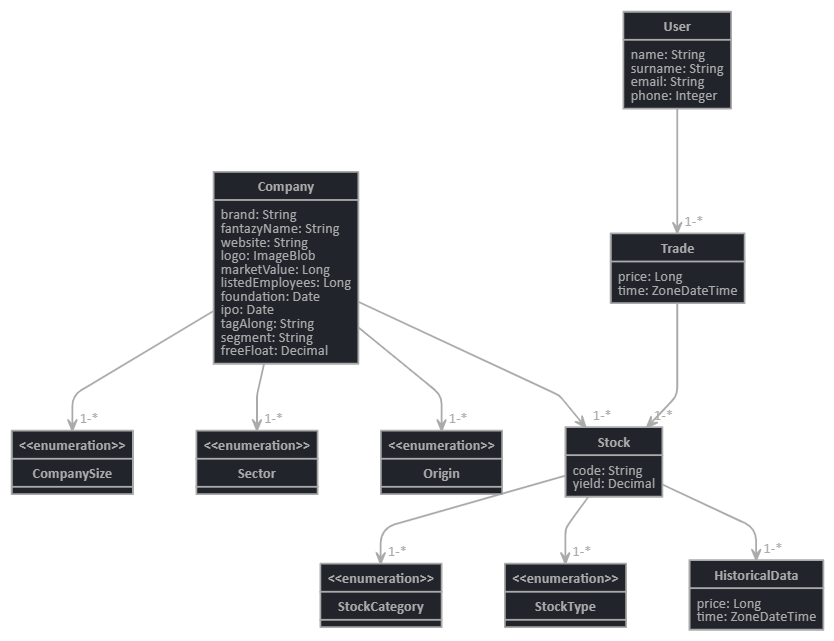

# Spring investments tracker

This is a concept project created with two simple objectives in mind
  
  1 - To get used and learn Spring on-the-fly 
  
  2 - To provide at the end a web service capable of tracking user investment gains and losses 

### Class diagram (updated 22/06/2020)

